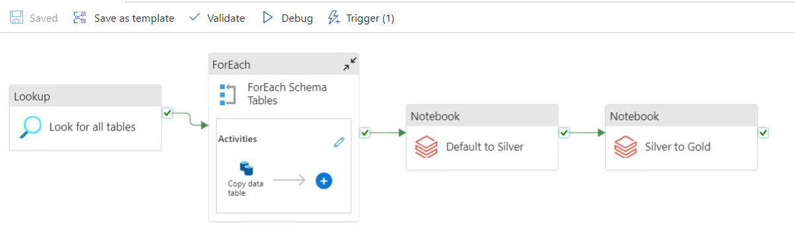

# AdventureWorks Data Pipeline with ADF, Databricks, and Delta Lake

This project demonstrates an ETL pipeline for processing data from a local SQL Server into a Delta Lake on Databricks using Azure Data Factory (ADF). The dataset used is the AdventureWorksLT2019, and the data processing follows a three-layer architecture: **Bronze**, **Silver**, and **Gold**.

## Project Overview



### Architecture:
- **Bronze Layer**: Raw data copied from an on-premises SQL Server to the Bronze layer in Databricks.
- **Silver Layer**: Data cleaned and transformed, particularly focusing on date formatting and data standardization.
- **Gold Layer**: Final cleaned data with renamed columns for ease of analysis.

### Technology Stack:
- **Azure Data Factory (ADF)**: Orchestrates the pipeline, triggers data movements, and manages workflows.
- **Databricks**: Provides the environment for data processing and transformation using Spark.
- **Delta Lake**: Stores data in a scalable format, with versioning and ACID transactions.

### Data Sources:
- **AdventureWorksLT2019**: A lightweight business database for a fictitious company.

---

## Pipeline Description

### 1. Data Extraction from SQL Server
- **Lookup**: The pipeline looks up all tables in the `OnPremSQLServer` (localhost SQL Server).
- **ForEach**: For each table found, data is copied from the SQL server to the Bronze layer as **parquet** files.

### 2. Data Transformation (Bronze to Silver)
- **Notebook**: A Databricks notebook loads parquet files from the Bronze layer (`mnt/awlt2019/SalesLT`), performs the following transformations:
  - Convert all columns with `Date` in their name to a standardized `yyyy-MM-dd` format.
  - Write the transformed data to the Silver layer (`mnt/awlt2019-silver`) in **Delta** format.

### 3. Data Standardization (Silver to Gold)
- **Notebook**: A Databricks notebook loads Delta files from the Silver layer and performs the following:
  - Rename columns from camelCase to snake_case for consistency.
  - Write the cleaned data to the Gold layer (`mnt/awlt2019-gold`) in **Delta** format.

### 4. Daily Data Refresh
- The pipeline is triggered every day at 00:00 (midnight) to refresh the data.

---

## File Structure

```plaintext
├── README.md
├── azure-pipelines
│   └── adf-pipeline.json        # ADF pipeline JSON definition
├── notebooks
│   ├── default_to_silver.py     # Notebook script for Bronze to Silver transformation
│   └── silver_to_gold.py        # Notebook script for Silver to Gold transformation
├── data
│   └── adventureworks2019lt      # Sample dataset
└── docs
    └── architecture_diagram.png  # Architecture diagram for the project
```

## How to Run the Project
Clone the repository:

```bash
git clone https://github.com/yourusername/adventureworks-adf-pipeline.git
```
Configure Azure Data Factory:
Import the ADF pipeline JSON file located in azure-pipelines/adf-pipeline.json.
Modify the linked service to point to your OnPremSQLServer instance.
Set Up Databricks:
Upload the Python notebooks located in the notebooks/ folder to your Databricks workspace.
Modify the notebook paths in ADF to match your Databricks configuration.
Set Up Delta Lake Storage:

Ensure that you have access to the appropriate mount points (mnt/awlt2019, mnt/awlt2019-silver, mnt/awlt2019-gold).
Modify the paths in the notebooks to reflect your Delta Lake storage configuration.
Trigger the Pipeline:

Schedule the ADF pipeline or manually trigger it to run the ETL process.
Sample Code
Notebook: Bronze to Silver
```python
inputPath = '/mnt/awlt2019/SalesLT/Address/Address.parquet'
df = spark.read.format('parquet').load(inputPath)

from pyspark.sql.functions import from_utc_timestamp, date_format
from pyspark.sql.types import TimestampType

df = df.withColumn('ModifiedDate', date_format(from_utc_timestamp(df['ModifiedDate'].cast(TimestampType()), 'UTC'), 'yyyy-MM-dd'))
df.write.format('delta').mode('overwrite').save('/mnt/awlt2019-silver/SalesLT/Address/')
```
Notebook: Silver to Gold
```python
inputPath = '/mnt/awlt2019-silver/SalesLT/Address/'
df = spark.read.format('delta').load(inputPath)

column_names = df.columns
for old_col_name in column_names:
    new_col_name = "".join(["_" + char if char.isupper() else char for char in old_col_name]).lstrip("_")
    df = df.withColumnRenamed(old_col_name, new_col_name)

df.write.format('delta').mode('overwrite').save('/mnt/awlt2019-gold/SalesLT/Address/')
```
## Scheduling
The pipeline is configured to refresh the data daily at 00:00 (midnight). You can modify the schedule in Azure Data Factory by adjusting the pipeline trigger settings.

## References
This project was inspired by tutorials from Mr. K Talks Tech, who provides excellent resources for working with ADF and Databricks.
